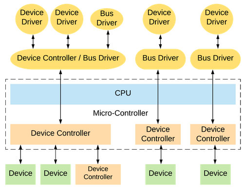

# Sistemas de Computacion
Trabajo Practico 5 - Driver GPIO

## Character Device Driver (CDD)

**Integrantes:**
- [Gil Cernich, Manuel](https://github.com/manugcr/)
- [Pallardo, Agustin](https://github.com/djpallax)
- [Saporito, Franco](https://github.com/fasaporito)

---

## Objetivo
Para superar este TP tendrán que diseñar y construir un CDD que permita **sensar dos señales externas con un periodo de UN segundo**. Luego una aplicación a nivel de usuario deberá **leer UNA de las dos señales y graficarla** en función del tiempo. La aplicación tambien debe poder **indicarle al CDD cuál de las dos señales leer**. Las correcciones de escalas de las mediciones, de ser necesario, se harán a nivel de usuario. Los gráficos de la señal deben indicar el tipo de señal que se está sensando, unidades en abcisas y tiempo en ordenadas. Cuando se cambie de señal el gráfico se debe "resetear" y acomodar a la nueva medición.

Se recomienda utilizar una **Raspberry Pi** para desarrollar este TP.

Algunos ejemplos de drivers fueron proporcionados por la catedra desde el repositorio en gitlab [device-drivers-main](https://gitlab.com/sistemas-de-computacion-unc/device-drivers/)

---

## Que es un Driver?
Un **driver** es un software que permite que el sistema operativo se comunique con el hardware de la computadora. Actúa como un traductor entre el sistema operativo y el hardware, facilitando la ejecución de comandos y la transferencia de datos. Los drivers son esenciales para el funcionamiento correcto de los dispositivos, ya que sin ellos el sistema operativo no podría reconocer ni utilizar el hardware.

### Que es un Device Driver?
Un **device driver** es un tipo de driver que permite que el sistema operativo controle y utilice un dispositivo hardware específico, como una impresora, una tarjeta gráfica o un disco duro. Cada tipo de hardware tiene su propio device driver, que proporciona la interfaz necesaria para que el sistema operativo y el dispositivo se entiendan mutuamente.

El device driver tiene dos partes, una parte específica del dispositivo y otra parte específica del sistema operativo.

### Que es un Device Controller?
Un **device controller** es un componente de hardware que actúa como intermediario entre el dispositivo físico y el sistema operativo. Este controlador maneja las operaciones del dispositivo, traduce las señales de los drivers en acciones físicas (como mover un cabezal de lectura/escritura en un disco duro) y gestiona la transferencia de datos entre el dispositivo y la memoria principal de la computadora.

El device driver se comunica con el device controller para enviar comandos y recibir datos desde el dispositivo. El driver traduce las instrucciones del sistema operativo en comandos que el controller puede entender y ejecutar.

El device controller muchas veces necesita de un driver propio, llamado **bus driver**. Este es un tipo de driver que permite que el sistema operativo se comunique con un bus de hardware, como un bus PCI o USB.

### Que es un Bus Driver?
Un **bus driver** es un tipo de driver que permite que el sistema operativo se comunique con un bus de hardware, como un bus PCI o USB. Los buses de hardware son canales de comunicación que conectan los dispositivos de hardware con la CPU y la memoria de la computadora. Los bus drivers proporcionan la interfaz necesaria para que el sistema operativo pueda detectar, configurar y comunicarse con los dispositivos conectados al bus.

<p align="center">
  <br>
  <em>Fig 1. Diagrama drivers y buses.</em>
</p>

---

## Character Device Driver
Un character device driver (CDD) es un tipo de driver en un sistema operativo que gestiona dispositivos que transfieren datos de forma secuencial, carácter por carácter. Los ejemplos comunes de dispositivos de carácter incluyen teclados, mouse y puertos serie . A diferencia de los block device drivers que manejan grandes bloques de datos a la vez (como discos duros), los character device drivers gestionan la transmisión y recepción de datos en pequeñas unidades, típicamente bytes.

Para utilizar un CDD, se utilizan los Character Device Files (CDF) que son archivos especiales en el sistema de archivos que representan dispositivos de carácter. Estos archivos se utilizan para enviar comandos y datos al dispositivo, y para recibir datos del dispositivo. Los CDF se crean y gestionan mediante el sistema de archivos virtual /dev en sistemas basados en Unix.

### Indice <Major, Minor>
En los sistemas operativos Unix y Linux, los dispositivos se representan mediante archivos especiales en el directorio /dev. Estos archivos especiales permiten que los programas interactúen con los dispositivos de hardware como si fueran archivos normales. Cada uno de estos archivos especiales tiene asignado un par de números conocido como major number y minor number. 
- **Major Number**: Identifica el driver del dispositivo. Cada tipo de dispositivo tiene un driver asociado que maneja las operaciones de entrada y salida. El número mayor le dice al kernel de Linux cuál driver usar para comunicarse con el dispositivo. Por ejemplo, todos los discos duros pueden tener el mismo major number porque están gestionados por el mismo driver de disco.
- **Minor Number**: Se utiliza para identificar instancias específicas del dispositivo que el driver maneja. Si un driver maneja múltiples dispositivos, el número menor ayuda a distinguir entre ellos. Por ejemplo, si tienes varios discos duros, cada uno tendrá el mismo major number pero un minor number diferente para diferenciarlos.

Podemos verlos ejecutando el comando `ls -l /dev` en la terminal, donde `b` o `c` identifican si es un block device o un character device respectivamente, y el par major-minor se encuentra en las columnas 5 y 6.

```bash
manu@manu:~$ ls -l /dev
brw-rw----  1 root disk      8,    17 May 26 12:07 sdb1
brw-rw----  1 root disk      8,    18 May 26 12:07 sdb2
brw-rw----  1 root disk      8,    19 May 26 12:07 sdb3
crw--w----  1 root tty       4,    10 May 26 12:07 tty10
crw--w----  1 root tty       4,    11 May 26 12:07 tty11
crw--w----  1 root tty       4,    12 May 26 12:07 tty12
```
## Escritura y Lectura de un CDD
Para escribir y leer un CDD se utilizan las funciones `write()` y `read()` respectivamente. Estas funciones se utilizan para enviar y recibir datos desde el dispositivo. La función `write()` se utiliza para enviar datos al dispositivo, mientras que la función `read()` se utiliza para recibir datos del dispositivo.

```bash
open("/dev/ttyS0", O_RDWR);
write(fd, "Hello, Device!\n", 15);
read(fd, buffer, sizeof(buffer));
```

Tambien es posible utilizar la terminal para interactuar con el CDD, utilizando el comando `echo` para escribir en el dispositivo y `cat` para leer del dispositivo.

```bash
cat /dev/ttyS0
echo "Hello, Device!" > /dev/ttyS0
```

---

## Creacion de un Character Device Driver
Para crear y probar nuestro CDD, vamos a utilizar una Raspberry Pi 3B+ con el sistema operativo Raspbian 64bits. Para poder instalar el sistema operativo en la Raspberry Pi, se utiliza la herramienta [Raspberry Pi Imager](https://www.raspberrypi.org/software/) y una tarjeta SD de 8gb.

El siguiente driver es un driver por `/dev/` aun que tambien se pueda crear por `/procs/`.

#### Physical Addresses
Los GPIOs (General Purpose Input/Output) son pines que se pueden configurar como entradas o salidas digitales. Los pines se numeran del 0 al 27, y para poder utilizarlos hay que tener cuenta que para el chip `BCM2837` la direccion de memoria base donde se encuentran los registros de los GPIOs es `0x3F200000`, como podemos ver en la documentacion de [BCM2837 ARM Peripherals](https://cs140e.sergio.bz/docs/BCM2837-ARM-Peripherals.pdf), donde la direccion de memoria inicial es `0x3F000000` y se tiene un offset de `0x200000`. 

En linux el acceso directo a la memoria fisica se realiza a traves del mapeo de memoria, para esto se utiliza la funcion `ioremap()` que mapea una direccion fisica a una direccion virtual en el espacio de memoria del kernel. Para ello se mapean los gpios al iniciar el submodulo del kernel y luego se registra el driver con su respectivo major number para poder acceder a el desde el espacio de usuario.

```c
static int __init gpio_signal_init(void)
{
	printk(KERN_INFO "GPIO SIGNAL: Initializing.\n");

	// Map GPIO memory
	gpio_registers = (unsigned int *)ioremap(BCM2837_GPIO_ADDRESS, PAGE_SIZE);
	if (!gpio_registers)
	{
		printk(KERN_ALERT "GPIO SIGNAL: Failed to map GPIO memory.\n");
		return -ENOMEM;
	}

	printk(KERN_INFO "GPIO SIGNAL: Successfully mapped GPIO memory.\n");

	gpio_pin_input(gpio_pin1);
	gpio_pin_input(gpio_pin2);
	selected_pin = gpio_pin1;	// Default selected pin

	// Register character device
	major_number = register_chrdev(0, DEVICE_NAME, &fops);
	if (major_number < 0)
	{
		printk(KERN_ALERT "GPIO SIGNAL: Failed to register a major number.\n");
		iounmap(gpio_registers);
		return major_number;
	}

	printk(KERN_INFO "GPIO SIGNAL: Registered correctly with major number %d.\n", major_number);
	return 0;
}
```

#### GPIO como input
Para configurar un GPIO como entrada, se debe escribir un `0` en el registro `GPFSELn` correspondiente al GPIO que se quiere configurar. Cuanto trabajamos con GPIO en raspberry estos se agrupan en grupos de a 10 cada uno controlado por el registro `GPFSEL` con el cual podemos configurar cada pin individualmente.

Para ello primero calculamos el indice del registro `GPFSEL` y el bit correspondiente al pin que queremos configurar, con esto sabemos que el registro `GPFSEL` que queremos modificar es `gpio_registers + fsel_index` y el bit que queremos modificar es `fsel_bitpos`.

```c
static void gpio_pin_input(unsigned int pin)
{
	unsigned int fsel_index = pin / 10;
	unsigned int fsel_bitpos = pin % 10;
	unsigned int *gpio_fsel = gpio_registers + fsel_index;

	*gpio_fsel &= ~(7 << (fsel_bitpos * 3));  // Limpiar los bits para el pin
	*gpio_fsel |= (0 << (fsel_bitpos * 3));   // Configurar el pin como entrada
}
```

#### Lectura de un GPIO
El registro `GPLEV0` es el que contiene el valor de los pines 0-31, al cual accedemos con `*(gpio_registers + 13)`. Para leer el valor de un pin en particular, se debe hacer un `AND` entre el registro `GPLEV0` y el bit correspondiente al pin que se quiere leer.

```c
gpio_value = (*(gpio_registers + 13) & (1 << selected_pin)) != 0;
```

Este valor es el que se devuelve al usuario cuando se lee el CDD, en nuestro caso devuelve un string con el valor del pin seleccionado.

#### Seleccion de un GPIO
Para poder seleccionar desde que pin queremos obtener la señal necesitamos escribir en el CDD el numero del pin que queremos leer. El valor a escribir lo obtenemos desde el programa con la funciona copy_from_user() que copia datos desde el espacio de usuario al espacio de kernel.

```c
static ssize_t device_write(struct file *file, const char *buffer, size_t len, loff_t *offset)
{
    char kbuf[2];

    if (len > 1) len = 1;

    if (copy_from_user(kbuf, buffer, len))
        return -EFAULT;

    if (kbuf[0] == '1') {
        selected_pin = gpio_pin1;
    } else if (kbuf[0] == '2') {
        selected_pin = gpio_pin2;
    } else {
        return -EINVAL;
    }

    printk(KERN_INFO "GPIO SIGNAL: Selected pin %u.\n", selected_pin);

    return len;
}
```

## Conexiones fisicas
Las señales que vamos a sensar vienen de un timer `LM555` que genera una señal cuadrada con un periodo de 1 segundo (0.5 HIGH - 0.5 LOW), y una segunda señal que es simplemente un boton que se presiona para generar un pulso alto o bajo. Los pines utilizados por default como input son el GPIO 22 y el GPIO 27, pero estos se pueden dar como paramatros al cargar el modulo del kernel.

<p align="center">
  <br>
  <em>Fig 2. Pinout RPI 3b+.</em>
</p>

---
## Ejecucion
Para compilar el modulo del kernel se debe ejecutar el comando `make` en la carpeta del proyecto, esto generara el archivo `gpio_signal.ko` que se debe copiar a la raspberry pi. Luego se debe cargar el modulo con el comando `sudo insmod gpio-signal.ko gpio_pin1=22 gpio_pin2=27` y se puede ver el log del kernel con el comando `dmesg`.

```bash
$ dmesg | tail
[123.456789] GPIO SIGNAL: Device opened.
[123.567890] GPIO SIGNAL: Selected pin 22.
[123.678901] GPIO SIGNAL: Pin 22 set up as input.
[123.789012] GPIO SIGNAL: Value read 1.
[123.890123] GPIO SIGNAL: Device closed.
```

Para simplificar el proceso de carga del modulo se puede utilizar el script `build.sh` que carga el modulo con los pines por default. El cual tambien setea el major number del driver para poder acceder a el desde el espacio de usuario.

```bash
MAJOR_NUMBER=$(awk "\$2==\"$MODULE_NAME\" {print \$1}" /proc/devices)
```

El `minor number` complementa al `major number` al proporcionar una identificación única para un dispositivo específico manejado por un controlador de dispositivo en el sistema de archivos de dispositivos, para nuestro caso el minor number es 0.

Para poder tener comunicacion usuario-kernel necesitamos crear un archivo especial en `/dev/` con el comando `mknod /dev/gpio_signal c $MAJOR_NUMBER 0` y luego se puede escribir y leer del archivo con los comandos `echo` y `cat`. Con chmod se le da permisos de lectura y escritura al archivo.

```bash
sudo mknod $DEVICE_PATH c $MAJOR_NUMBER 0
sudo chmod 666 $DEVICE_PATH
```

### Programa a nivel de usuario
Para poder leer y escribir en el CDD se debe utilizar un programa a nivel de usuario que se comunique con el driver. En nuestro caso utilizamos un programa en python que lee el archivo `/dev/gpio_signal` y muestra el valor del pin seleccionado. 

Para la interfaz grafica y los plots se utilizo tkinter y matplotlib, en el cual se utilizaron threads para poder monitorear constantemente el valor de pin a graficar, y para poder cambiar el pin seleccionado desde la interfaz. Al cambiar de pin seleccionado se resetea el grafico.

<p align="center">
  <br>
  <em>Fig 2. Ejemplo de ejecucion del programa nivel usuario.</em>
</p>

---

## Video de ejemplo de ejecucion

<p align="center">
  <br>
  <em>Fig 3. Ejemplo de ejecucion.</em>
</p>

---

## Bibliografia

- [Raspberry Pi Kernel Development - LowLevelLearning](https://www.youtube.com/watch?v=lWzFFusYg6g&list=PLc7W4b0WHTAX4F1Byvs4Bp7c8yCDSiKa9)
- [Raspberry Pi C Kernel - LowLevelLearning](https://www.youtube.com/watch?v=mshVdGlGwBs)
- [Raspberry Pi Imager](https://www.raspberrypi.org/software/)
- [BCM2837 ARM Peripherals](https://cs140e.sergio.bz/docs/BCM2837-ARM-Peripherals.pdf)
- [Repositorio device-drivers-main](https://gitlab.com/sistemas-de-computacion-unc/device-drivers/)
